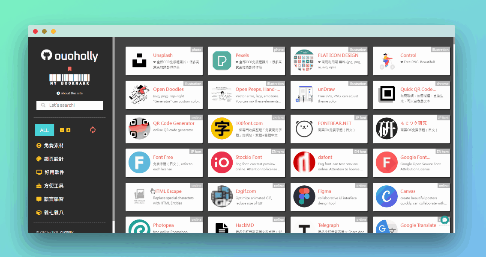
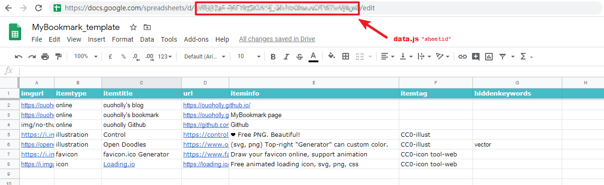
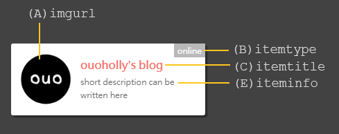

**MyBookmark:** <https://ouoholly.github.io/mybookmark/>

# Why I Did This

To organize and centralize my messy bookmarked urls.

In order to enable myself to make additions/deletions/updates on my bookmarked items conveniently no matter whether I'm using a mobile or desktop, decided to **store the data in Google spreadsheet**. Output the data as json and fetch them in html.

**Tag filtering**, **keywords searching** and **thumbnails previewing** features are created. Fully customizable and personalized in line with your own classification logic and way.


# Inspiration

Below are some awesome all-in-one-bookmark webpages:

+ [Evernote design - All in One Bookmark Links for Designer](https://www.evernote.design/)
+ [WebStackPage](http://webstack.cc/)
+ [The Stocks 2](http://thestocks.im/)
+ [Web Design Resources](https://simular.co/resources/)
+ [前端導航網](http://jsdig.com/)


# About

MyBookmark is purely built in HTML, CSS and JavaScript, with responsive design.

Used the following libraries/services :
+ [jQuery](https://code.jquery.com/)
+ [lazysizes](https://github.com/aFarkas/lazysizes)
+ [FontAwesome](https://fontawesome.com/)
+ [Isotope](https://isotope.metafizzy.co/) (filtering and searching features)
+ [activate-power-mode](http://0xabcdef.com/activate-power-mode/) (typing effect used in search box)
+ [Cbox](http://www.cbox.ws/) (live chat comment box widget)
+ [LikeBtn](http://likebtn.com/) (like button widget)
+ Google spreadsheet (data storage)


# License

Feel free to fork or download this as template and make edits to fit your needs as long as credit is given and link back to <https://github.com/ouoholly/mybookmark> in your webpage.

Star the repo if you like it (σﾟ∀ﾟ)σ..☆

Welcome to contact me for suggestions or recommendations. (●'∀'●)ノ


# How To Use

Mainly edit the following two files:
+ data.js
+ index.html

Here is a [Google spreedsheet template](https://bit.ly/mybookmark-spreadsheet-template) for your ease of use.

1. Make a copy of the template to your Google Drive (`File` > `Make a Copy`).

2. Publish your spreadsheet to the web (`File` > `Publish to the web`).

3. Copy your spreadsheet id to the `sheetid` variable in `data.js`.



4. Now, you would see the content of the webpage is displayed the same as your spreadsheet content. 

5. Work on your spreadsheet, enriching your content!

## Spreadsheet
There are 7 columns in the spreadsheet. Please do not make any changes in the header (row 1), otherwise, data will not be able to display successfully in your webpage.

All the content in these 7 columns are searchable in the search box.



| column | spreadsheet header  | explanation |
| ------ | ---------------- | ----------- |
| A      | imgurl          | thumbnail image url (it will display as `img/no-thumbnail.png` if this field is empty)       |
| B      | itemtype        | top-right grey corner of the item       |
| C      | itemtitle       | item title     |
| D      | url             | the url to be navigated when the item is being clicked  |
| E      | iteminfo        | short description of the item      |
| F      | itemtag         | tags of the item. related to the **tag filter section** in `index.html`. can input multiple tags for one item, use space to separate them        |
| G      | hiddenkeywords  | words inputted in this field will not be displayed on the webpage but they are searchable via search box    |


Of course, you may use static json file (the loading time would probably be much faster) or other mediums other than Google spreadsheet to store your data, just edit `data.js` to fit your needs!

Edit the `index.html` to change the info, such as title and tag filter section to fit as yours. I've made remarks inside the files. Feel free to contact me if you have any questions.

## Sturcture of the tag filter section
For your ease of convenience, you may refer to the `tag-filter` sheet (column E) in the [Google spreedsheet template](https://bit.ly/mybookmark-spreadsheet-template).

```html
<div class="tagarea_ind">
    <h3 class="tagcat"> {tag category name} </h3>
    <div class="tagdetails">
        <button class="tag" data-filter=".{tag name}"> {tag dispay name} </button>
        <button class="tag" data-filter=".{tag name}"> {tag dispay name} </button>
        <button class="tag" data-filter=".{tag name}"> {tag dispay name} </button>
    </div>
</div>  
```

## Structure of each item
For reference only. The following item code will be auto-generated for you.
```html
<a href="[url]" target="_blank">
    <div class="item [itemtag]">
        <div class="itemimg"></div>
        <div class="itemtitle">[itemtitle]</div>
        <div class="iteminfo">[iteminfo]</div>
        <div class="itemtype">[itemtype]</div>
        <div class="itemtag">[itemtag]</div>
        <div class="itemurl">[url]</div>
       <div class="hiddenkeywords">[hiddenkeywords]</div>
    </div>
</a>  
```
